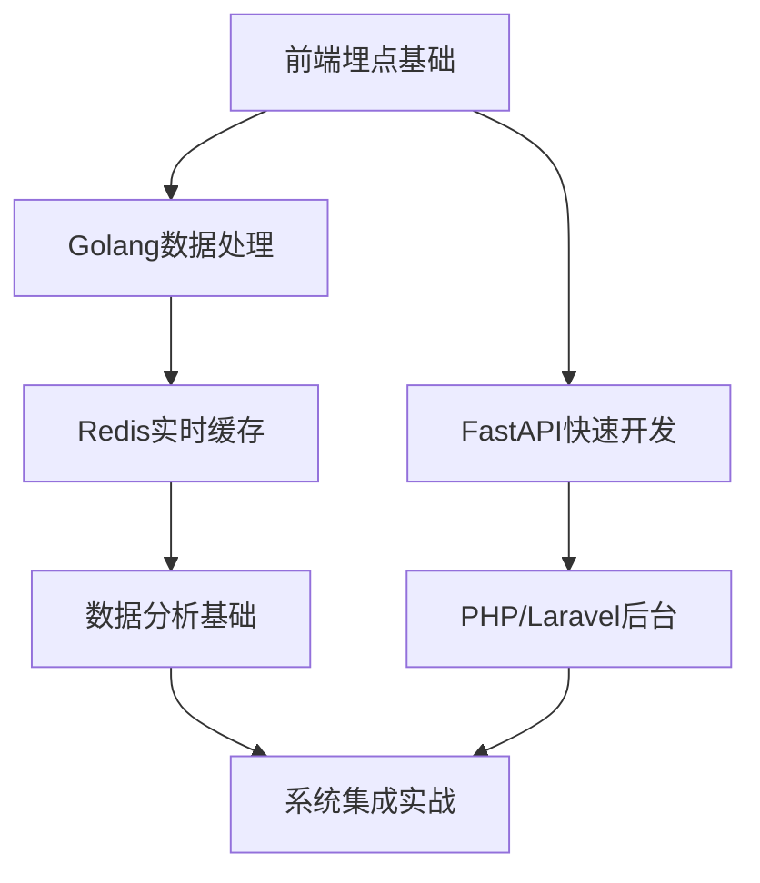

# 用户行为分析平台开发教程

## 基于二八定律的核心知识掌握指南

> **核心理念**：掌握20%的关键知识，解决80%的实际问题

---

## 🎯 学习路线图



---

## 📚 核心知识模块（20%关键知识）

### 1. 前端埋点基础 ⭐⭐⭐⭐⭐

**重要性**：数据采集是整个系统的起点，无数据则无分析

#### 必须掌握的知识点

```javascript
// 1. 事件监听和数据收集
class BehaviorTracker {
  constructor() {
    this.sessionId = this.generateSessionId();
    this.initEventListeners();
  }
  
  // 核心：统一的事件追踪接口
  track(eventType, data) {
    const payload = {
      timestamp: Date.now(),
      sessionId: this.sessionId,
      eventType,
      ...data
    };
    this.send(payload);
  }
  
  // 自动化点击追踪
  initEventListeners() {
    document.addEventListener('click', (e) => {
      this.track('click', {
        element: e.target.tagName,
        text: e.target.textContent,
        position: { x: e.clientX, y: e.clientY }
      });
    });
  }
}
```

#### 学习重点

- **DOM事件监听**（2小时掌握）
- **数据序列化和发送**（1小时掌握）
- **会话管理**（1小时掌握）

**实战练习**：为一个购物网站添加点击、浏览、加购车埋点

---

### 2. FastAPI快速开发 ⭐⭐⭐⭐⭐

**重要性**：BFF层是多端数据聚合的核心，FastAPI提供高性能异步处理

#### 必须掌握的知识点

```python
from fastapi import FastAPI, HTTPException
from pydantic import BaseModel
import asyncio
import httpx

app = FastAPI()

# 1. 数据模型定义
class DashboardResponse(BaseModel):
    online_users: int
    hot_pages: list
    conversion_rate: float

# 2. 异步数据聚合（核心技能）
@app.get("/bff/{client_type}/dashboard")
async def get_dashboard(client_type: str):
    # 并行调用多个数据源
    async with httpx.AsyncClient() as client:
        tasks = [
            client.get("http://golang-service/users/online"),
            client.get("http://golang-service/pages/hot"),
            client.get("http://golang-service/conversion/rate")
        ]
        responses = await asyncio.gather(*tasks)
    
    # 数据组装和客户端适配
    if client_type == "mobile":
        return {"online": responses[0].json()["count"]}
    else:
        return {
            "online_users": responses[0].json()["count"],
            "hot_pages": responses[1].json()["pages"],
            "conversion_rate": responses[2].json()["rate"]
        }

# 3. 错误处理和数据验证
@app.post("/track")
async def receive_events(events: list):
    try:
        # 批量处理事件数据
        await process_events(events)
        return {"status": "success"}
    except Exception as e:
        raise HTTPException(status_code=500, detail=str(e))
```

#### 学习重点

- **异步编程基础**（4小时掌握）：`async/await`、`asyncio.gather()`
- **Pydantic数据验证**（2小时掌握）：自动类型检查和文档生成
- **HTTP客户端调用**（2小时掌握）：`httpx`库的使用
- **路由和中间件**（2小时掌握）：RESTful API设计

**实战练习**：构建一个聚合多个微服务数据的BFF接口

---

### 3. Golang数据处理核心 ⭐⭐⭐⭐⭐

**重要性**：Golang是数据处理层的核心，负责高并发的流数据处理和微服务构建

#### 必须掌握的知识点

```go
package main

import (
    "context"
    "database/sql"
    "encoding/json"
    "net/http"
    "time"
    "log"
    
    "github.com/Shopify/sarama"
    "github.com/go-redis/redis/v8"
    _ "github.com/go-sql-driver/mysql"
)

// 1. 用户事件结构体
type UserEvent struct {
    UserID    string `json:"user_id"`
    EventType string `json:"event_type"`
    Timestamp int64  `json:"timestamp"`
    PageURL   string `json:"page_url"`
    Element   string `json:"element"`
}

// 2. 核心事件处理器
type EventProcessor struct {
    redisClient *redis.Client
    mysqlDB     *sql.DB
    producer    sarama.SyncProducer
}

// 3. Kafka消费者处理事件流（核心功能）
func (ep *EventProcessor) ConsumeEvents() {
    consumer, _ := sarama.NewConsumer([]string{"localhost:9092"}, nil)
    partitionConsumer, _ := consumer.ConsumePartition("user_events", 0, sarama.OffsetNewest)
    
    for message := range partitionConsumer.Messages() {
        var event UserEvent
        if err := json.Unmarshal(message.Value, &event); err != nil {
            log.Printf("解析事件失败: %v", err)
            continue
        }
        
        // 使用Goroutine并发处理
        go ep.processEvent(event)
    }
}

// 4. 实时数据处理（业务核心）
func (ep *EventProcessor) processEvent(event UserEvent) {
    ctx := context.Background()
    
    // Redis实时统计更新
    switch event.EventType {
    case "click":
        ep.redisClient.ZIncrBy(ctx, "hot_pages", 1, event.PageURL)
        ep.redisClient.SAdd(ctx, "online_users", event.UserID)
        ep.redisClient.Expire(ctx, "online_users", 5*time.Minute)
    case "purchase":
        ep.redisClient.Incr(ctx, "total_orders")
        ep.triggerConversionAnalysis(event.UserID)
    }
    
    // MySQL持久化存储
    query := `INSERT INTO user_events (user_id, event_type, timestamp, page_url, element) 
              VALUES (?, ?, ?, ?, ?)`
    ep.mysqlDB.Exec(query, event.UserID, event.EventType, event.Timestamp, event.PageURL, event.Element)
}

// 5. HTTP API服务（供FastAPI BFF调用）
func (ep *EventProcessor) StartAPIServer() {
    http.HandleFunc("/api/stats/online", ep.getOnlineUsers)
    http.HandleFunc("/api/stats/hot-pages", ep.getHotPages)
    http.HandleFunc("/api/stats/conversion", ep.getConversionRate)
    
    log.Println("Golang API服务启动在 :8080")
    http.ListenAndServe(":8080", nil)
}

func (ep *EventProcessor) getOnlineUsers(w http.ResponseWriter, r *http.Request) {
    ctx := context.Background()
    count := ep.redisClient.SCard(ctx, "online_users").Val()
    
    w.Header().Set("Content-Type", "application/json")
    json.NewEncoder(w).Encode(map[string]int64{"count": count})
}

// 6. 高并发连接池管理
func initRedisClient() *redis.Client {
    return redis.NewClient(&redis.Options{
        Addr:        "localhost:6379",
        PoolSize:    10,  // 连接池大小
        MaxRetries:  3,   // 重试次数
    })
}
```

#### 学习重点

- **Goroutine并发编程**（6小时掌握）：处理高并发事件流的核心
- **Kafka Sarama库**（4小时掌握）：消费者组、分区处理、错误处理
- **Redis Go客户端**（3小时掌握）：连接池、原子操作、过期策略
- **MySQL数据库操作**（3小时掌握）：连接池、预编译语句、事务
- **HTTP服务构建**（3小时掌握）：net/http包、中间件、RESTful API

**实战练习**：构建一个处理每秒10K+事件的高并发服务

---

### 4. PHP/Laravel管理后台 ⭐⭐⭐

**重要性**：构建数据分析的管理界面，方便业务人员使用

#### 必须掌握的知识点

```php
<?php
// 1. Laravel控制器 - 数据大屏管理
namespace App\Http\Controllers;

use Illuminate\Http\Request;
use Illuminate\Support\Facades\Http;

class AnalyticsController extends Controller
{
    // 调用FastAPI BFF获取数据
    public function dashboard(Request $request)
    {
        $clientType = $request->get('client_type', 'web');
        
        // 调用BFF层获取聚合数据
        $response = Http::get("http://fastapi-bff/bff/{$clientType}/dashboard");
        $analyticsData = $response->json();
        
        return view('analytics.dashboard', [
            'online_users' => $analyticsData['online_users'],
            'hot_pages' => $analyticsData['hot_pages'],
            'conversion_rate' => $analyticsData['conversion_rate']
        ]);
    }
    
    // 用户行为查询
    public function userBehavior(Request $request)
    {
        $userId = $request->get('user_id');
        $startDate = $request->get('start_date');
        $endDate = $request->get('end_date');
        
        $response = Http::get("http://golang-service/api/user/{$userId}/events", [
            'start_date' => $startDate,
            'end_date' => $endDate
        ]);
        
        return response()->json($response->json());
    }
}

// 2. 数据表管理和缓存
class EventModel extends Model
{
    protected $table = 'user_events';
    protected $fillable = ['user_id', 'event_type', 'timestamp', 'page_url'];
    
    // 获取热门页面（缓存1小时）
    public static function getHotPages($limit = 10)
    {
        return Cache::remember('hot_pages', 3600, function() use ($limit) {
            return DB::table('user_events')
                ->select('page_url', DB::raw('count(*) as views'))
                ->where('event_type', 'view')
                ->where('created_at', '>=', now()->subDay())
                ->groupBy('page_url')
                ->orderBy('views', 'desc')
                ->limit($limit)
                ->get();
        });
    }
}

// 3. API资源 - 数据格式化
class AnalyticsResource extends JsonResource
{
    public function toArray($request)
    {
        return [
            'user_id' => $this->user_id,
            'events' => $this->events->map(function($event) {
                return [
                    'type' => $event->event_type,
                    'timestamp' => $event->timestamp,
                    'page' => $event->page_url
                ];
            }),
            'summary' => [
                'total_events' => $this->events->count(),
                'unique_pages' => $this->events->pluck('page_url')->unique()->count()
            ]
        ];
    }
}
```

#### 学习重点

- **Laravel基础框架**（4小时掌握）：路由、控制器、模型
- **HTTP客户端调用**（2小时掌握）：调用BFF和Golang服务
- **缓存策略**（2小时掌握）：Redis缓存、查询优化
- **Blade模板引擎**（2小时掌握）：数据展示界面

**实战练习**：构建一个数据分析的管理后台

---

### 5. Redis实时缓存 ⭐⭐⭐⭐

**重要性**：提供秒级数据查询和实时指标计算

#### 必须掌握的知识点

```python
import redis
from datetime import datetime, timedelta

r = redis.Redis(host='localhost', port=6379, db=0)

# 1. 实时在线用户数统计
def update_online_users(user_id):
    # 使用SET存储活跃用户，自动去重
    r.sadd("online_users", user_id)
    r.expire("online_users", 300)  # 5分钟过期

def get_online_count():
    return r.scard("online_users")

# 2. 热门页面排行榜
def increment_page_view(page_url):
    # 使用ZSET实现排行榜
    r.zincrby("hot_pages", 1, page_url)
    
def get_hot_pages(limit=10):
    # 按访问量倒序获取热门页面
    return r.zrevrange("hot_pages", 0, limit-1, withscores=True)

# 3. 用户会话数据缓存
def cache_user_session(session_id, data):
    r.hset(f"session:{session_id}", mapping=data)
    r.expire(f"session:{session_id}", 1800)  # 30分钟过期
```

#### 学习重点

- **五种数据类型使用场景**（3小时掌握）：String、Hash、List、Set、ZSet
- **过期时间管理**（1小时掌握）：TTL设置
- **原子操作**（2小时掌握）：计数器、排行榜
- **内存优化**（1小时了解）：合理设置过期时间

**实战练习**：实现一个实时用户行为统计系统

---

### 6. 数据分析基础概念 ⭐⭐⭐

**重要性**：理解业务指标和分析模型

#### 必须掌握的概念

```python
# 1. 漏斗分析计算
def calculate_funnel_conversion(events):
    """
    计算转化漏斗：浏览 -> 点击 -> 加购 -> 购买
    """
    steps = ['view', 'click', 'add_cart', 'purchase']
    funnel_data = {}
    
    for i, step in enumerate(steps):
        step_users = set()
        for event in events:
            if event['type'] == step:
                step_users.add(event['user_id'])
        
        funnel_data[step] = {
            'count': len(step_users),
            'conversion_rate': len(step_users) / funnel_data.get(steps[0], {}).get('count', 1) if i > 0 else 1
        }
    
    return funnel_data

# 2. 用户留存分析
def calculate_retention(user_events, days=7):
    """
    计算N日留存率
    """
    from collections import defaultdict
    
    first_visit = defaultdict(str)  # 用户首次访问日期
    daily_users = defaultdict(set)  # 每日活跃用户
    
    for event in user_events:
        user_id = event['user_id']
        date = event['date']
        
        if user_id not in first_visit:
            first_visit[user_id] = date
        daily_users[date].add(user_id)
    
    # 计算留存
    retention_data = {}
    for date, users in daily_users.items():
        retained_users = 0
        for user_id in users:
            target_date = first_visit[user_id] + timedelta(days=days)
            if user_id in daily_users.get(target_date, set()):
                retained_users += 1
        
        retention_data[date] = retained_users / len(users) if users else 0
    
    return retention_data
```

#### 学习重点

- **漏斗分析原理**（2小时理解）：转化率计算
- **用户分群逻辑**（2小时理解）：RFM模型基础
- **留存率计算**（2小时掌握）：日留存、周留存
- **热力图概念**（1小时了解）：页面交互分析

**实战练习**：为电商网站计算购买转化漏斗

---

## 🚀 快速上手实战项目

### 项目目标

用7天时间构建一个简化版的用户行为分析系统

### Day 1-2：前端埋点

```javascript
// 创建最简单的埋点SDK
class SimpleTracker {
  constructor(apiUrl) {
    this.apiUrl = apiUrl;
    this.events = [];
    this.startTracking();
  }
  
  track(event) {
    this.events.push({
      ...event,
      timestamp: Date.now(),
      url: window.location.href
    });
    
    // 批量发送
    if (this.events.length >= 10) {
      this.flush();
    }
  }
  
  flush() {
    fetch(this.apiUrl, {
      method: 'POST',
      body: JSON.stringify(this.events)
    });
    this.events = [];
  }
  
  startTracking() {
    // 自动追踪点击
    document.addEventListener('click', (e) => {
      this.track({
        type: 'click',
        element: e.target.tagName,
        text: e.target.textContent?.slice(0, 100)
      });
    });
  }
}

// 使用
const tracker = new SimpleTracker('/api/events');
```

### Day 3-4：Golang事件处理服务

```go
// main.go - 核心事件处理
package main

import (
    "context"
    "encoding/json"
    "log"
    "net/http"
    "github.com/go-redis/redis/v8"
)

type EventService struct {
    redis *redis.Client
}

func (es *EventService) handleEvents(w http.ResponseWriter, r *http.Request) {
    var events []map[string]interface{}
    json.NewDecoder(r.Body).Decode(&events)
    
    ctx := context.Background()
    for _, event := range events {
        // 实时统计更新
        if event["type"] == "click" {
            es.redis.ZIncrBy(ctx, "hot_elements", 1, event["element"].(string))
        }
    }
    
    w.WriteHeader(200)
    json.NewEncoder(w).Encode(map[string]string{"status": "ok"})
}

func main() {
    es := &EventService{
        redis: redis.NewClient(&redis.Options{Addr: "localhost:6379"}),
    }
    
    http.HandleFunc("/api/events", es.handleEvents)
    log.Println("Golang服务启动在 :8080")
    http.ListenAndServe(":8080", nil)
}
```

### Day 5-6：FastAPI BFF层

```python
# 聚合Golang服务数据
from fastapi import FastAPI
import httpx

app = FastAPI()

@app.get("/bff/web/dashboard")
async def get_web_dashboard():
    async with httpx.AsyncClient() as client:
        # 调用Golang微服务
        stats = await client.get("http://golang-service:8080/api/stats")
        
        return {
            "online_users": stats.json()["online_count"],
            "hot_elements": stats.json()["hot_elements"]
        }
```

### Day 7：Laravel管理界面

```php
// Laravel控制器
class DashboardController extends Controller 
{
    public function index() 
    {
        $response = Http::get('http://fastapi-bff/bff/web/dashboard');
        $data = $response->json();
        
        return view('dashboard', compact('data'));
    }
}
```

---

## 📖 深入学习资源

### 必读文档（优先级排序）

1. **FastAPI官方文档** - async/await部分 ⭐⭐⭐⭐⭐
2. **Redis官方命令参考** - 数据类型部分 ⭐⭐⭐⭐
3. **Kafka官方Quickstart** - 基础概念 ⭐⭐⭐⭐
4. **JavaScript Events MDN** - DOM事件 ⭐⭐⭐

### 实战项目建议

1. **Week 1**：完成基础埋点和数据收集
2. **Week 2**：实现实时统计和缓存
3. **Week 3**：添加基础分析功能
4. **Week 4**：优化性能和错误处理

---

## ⚡ 关键技能检查清单

完成以下检查点，即掌握了80%核心技能：

### 核心技术栈

- [ ] **前端埋点**：能够实现自动事件采集和批量发送
- [ ] **FastAPI开发**：能够构建异步BFF聚合接口
- [ ] **Golang并发**：能够处理高并发Kafka消息流
- [ ] **PHP/Laravel**：能够构建数据管理后台
- [ ] **Redis缓存**：能够实现实时计数和排行榜
- [ ] **数据分析**：理解漏斗分析和留存计算逻辑

### 系统集成能力

- [ ] 能够设计微服务间的API调用
- [ ] 具备基本的错误处理和日志记录
- [ ] 理解分布式系统的数据一致性问题
- [ ] 能够进行简单的性能优化

**掌握这10个核心技能，你就能构建出80%功能完整的用户行为分析系统！**

---

## 📋 技术栈对应关系

根据PRD架构，各技术的职责分工：

| 技术栈 | 主要职责 | 核心价值 | 学习优先级 |
|--------|----------|----------|------------|
| **JavaScript** | 前端埋点SDK | 数据采集源头 | ⭐⭐⭐⭐⭐ |
| **FastAPI** | BFF数据聚合 | 多端适配层 | ⭐⭐⭐⭐⭐ |
| **Golang** | 流数据处理 | 高并发核心 | ⭐⭐⭐⭐⭐ |
| **PHP/Laravel** | 管理后台 | 业务操作界面 | ⭐⭐⭐ |
| **Redis** | 实时缓存 | 性能加速 | ⭐⭐⭐⭐ |
| **Kafka** | 消息队列 | 系统解耦 | ⭐⭐⭐ |

> **学习建议**：优先掌握前3个五星技术，它们构成了系统的核心架构
